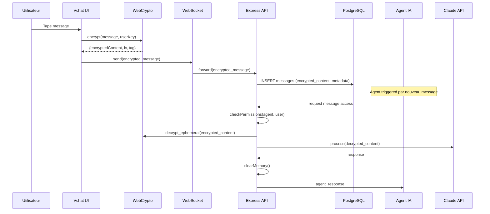
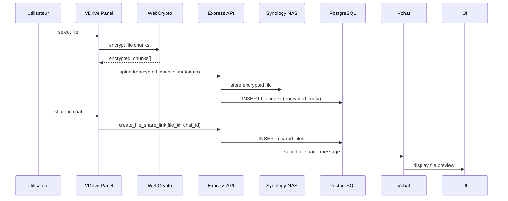
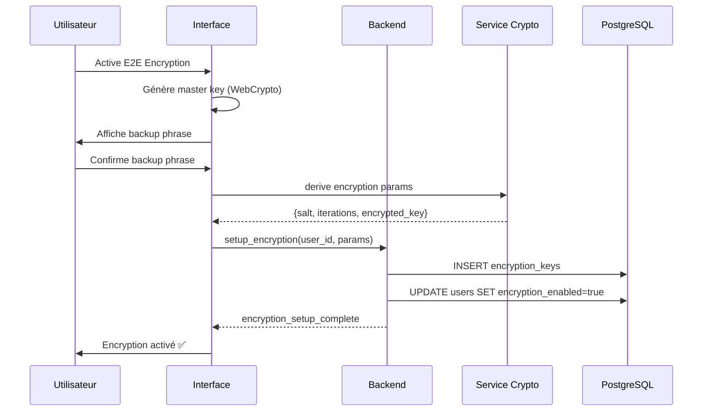
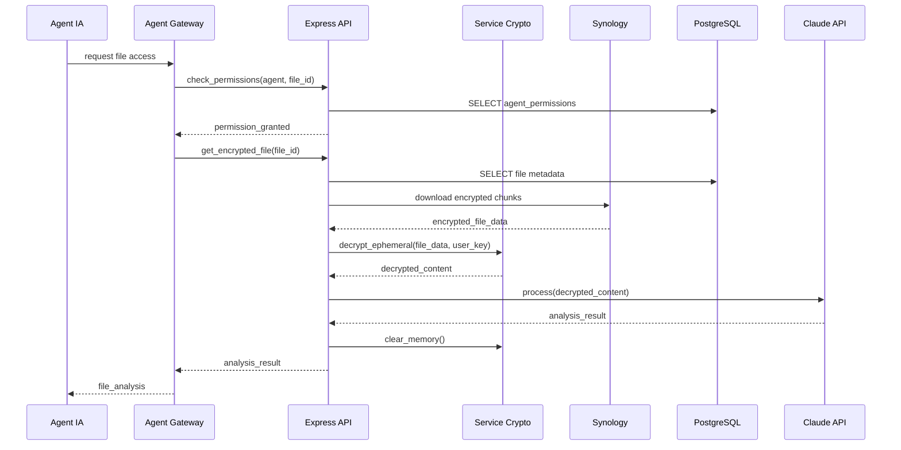
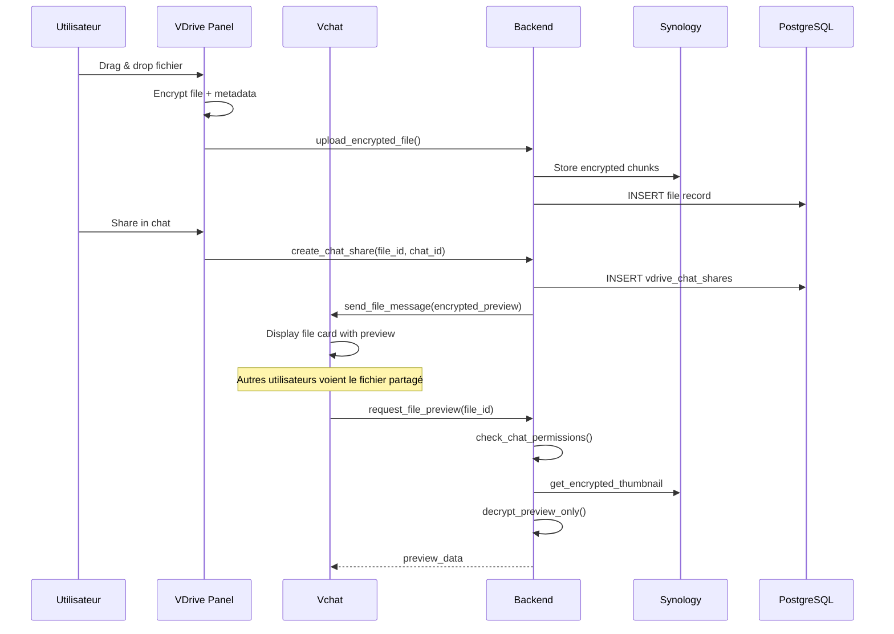

# Vue d'Ensemble de l'Architecture - Vutler Phase 2
**Version:** 1.0  
**Date:** 2026-02-23  
**Équipe:** Architecture Starbox Group

## Architecture Système avec Couche E2E

### Vue d'Ensemble Globale

```mermaid
graph TB
    subgraph "Client Layer"
        UI[Vchat UI]
        CryptoJS[WebCrypto Module]
        VDrivePanel[VDrive Panel]
    end
    
    subgraph "Network Layer"
        Nginx[Nginx Proxy]
        WS[WebSocket Gateway]
    end
    
    subgraph "Application Layer"
        API[Express API Server]
        Auth[Auth Service]
        Crypto[Crypto Service]
        VDriveAPI[VDrive API Bridge]
    end
    
    subgraph "AI Layer"
        AgentGateway[Agent Access Gateway]
        Claude[Claude API]
        Memory[Snipara Memory]
    end
    
    subgraph "Storage Layer"
        PG[(PostgreSQL 16)]
        Redis[(Redis Cache)]
        Synology[Synology NAS]
    end
    
    subgraph "External"
        GitHub[GitHub API]
        Webhooks[GitHub Webhooks]
    end
    
    UI ←→ CryptoJS
    UI ←→ VDrivePanel
    CryptoJS ←→ Nginx
    VDrivePanel ←→ Nginx
    
    Nginx ←→ WS
    Nginx ←→ API
    
    API ←→ Auth
    API ←→ Crypto
    API ←→ VDriveAPI
    
    Auth ←→ PG
    Crypto ←→ PG
    Crypto ←→ Redis
    
    VDriveAPI ←→ Synology
    
    AgentGateway ←→ Crypto
    AgentGateway ←→ Claude
    AgentGateway ←→ Memory
    
    API ←→ GitHub
    Webhooks → API
```

## Diagramme de Flux de Données pour Messages Chiffrés

### 1. Envoi de Message Chiffré



### 2. Upload et Partage Fichier VDrive



## Interaction des Composants

### Architecture en Couches

```mermaid
graph TB
    subgraph "Presentation Layer"
        WebUI[Web Interface]
        Mobile[Mobile App Future]
    end
    
    subgraph "API Gateway Layer"
        Gateway[Nginx Gateway]
        LoadBalancer[Load Balancer]
        RateLimiter[Rate Limiter]
    end
    
    subgraph "Business Logic Layer"
        ChatService[Chat Service]
        FileService[File Service]
        AuthService[Auth Service]
        CryptoService[Crypto Service]
        AgentService[Agent Service]
        GitHubService[GitHub Service]
    end
    
    subgraph "Data Access Layer"
        PGDAO[PostgreSQL DAO]
        RedisDAO[Redis DAO]
        SynologyDAO[Synology DAO]
        GitHubDAO[GitHub DAO]
    end
    
    subgraph "Infrastructure Layer"
        Database[(PostgreSQL)]
        Cache[(Redis)]
        FileStorage[(Synology)]
        External[External APIs]
    end
    
    WebUI → Gateway
    Mobile → Gateway
    
    Gateway → ChatService
    Gateway → FileService
    Gateway → AuthService
    
    ChatService → CryptoService
    FileService → CryptoService
    AuthService → CryptoService
    
    ChatService → AgentService
    FileService → AgentService
    
    GitHubService → AgentService
    
    ChatService → PGDAO
    FileService → SynologyDAO
    AuthService → PGDAO
    CryptoService → RedisDAO
    AgentService → PGDAO
    GitHubService → GitHubDAO
    
    PGDAO → Database
    RedisDAO → Cache
    SynologyDAO → FileStorage
    GitHubDAO → External
```

## Modifications du Schéma Base de Données

### Tables Existantes - Modifications

```sql
-- Messages table - ajout chiffrement
ALTER TABLE messages 
ADD COLUMN encrypted_content BYTEA,
ADD COLUMN encryption_version INTEGER DEFAULT 1,
ADD COLUMN encryption_key_id UUID,
ADD COLUMN decryption_permissions JSONB DEFAULT '{}',
ADD COLUMN created_at_encrypted BOOLEAN DEFAULT FALSE;

-- Users table - gestion clés
ALTER TABLE users
ADD COLUMN master_key_encrypted BYTEA,
ADD COLUMN key_derivation_params JSONB,
ADD COLUMN backup_phrase_hash VARCHAR(64),
ADD COLUMN encryption_enabled BOOLEAN DEFAULT FALSE;

-- Files table - métadonnées chiffrées  
ALTER TABLE files
ADD COLUMN encrypted_metadata JSONB,
ADD COLUMN file_key_encrypted BYTEA,
ADD COLUMN encryption_algorithm VARCHAR(50) DEFAULT 'AES-256-GCM',
ADD COLUMN synology_path_encrypted VARCHAR(500);
```

### Nouvelles Tables

```sql
-- Gestion des clés de chiffrement
CREATE TABLE encryption_keys (
    id UUID PRIMARY KEY DEFAULT gen_random_uuid(),
    user_id UUID NOT NULL REFERENCES users(id),
    key_type VARCHAR(50) NOT NULL, -- 'master', 'session', 'file'
    encrypted_key BYTEA NOT NULL,
    key_params JSONB NOT NULL,
    created_at TIMESTAMP DEFAULT NOW(),
    expires_at TIMESTAMP,
    revoked_at TIMESTAMP,
    INDEX idx_encryption_keys_user (user_id),
    INDEX idx_encryption_keys_type (key_type)
);

-- Permissions d'accès agents
CREATE TABLE agent_permissions (
    id UUID PRIMARY KEY DEFAULT gen_random_uuid(),
    user_id UUID NOT NULL REFERENCES users(id),
    agent_name VARCHAR(100) NOT NULL,
    resource_type VARCHAR(50) NOT NULL, -- 'chat', 'files', 'vdrive'
    access_level VARCHAR(50) NOT NULL, -- 'denied', 'metadata', 'decrypt_ephemeral'
    conditions JSONB DEFAULT '{}',
    created_at TIMESTAMP DEFAULT NOW(),
    updated_at TIMESTAMP DEFAULT NOW(),
    UNIQUE(user_id, agent_name, resource_type)
);

-- Log des accès de déchiffrement
CREATE TABLE decryption_audit_log (
    id UUID PRIMARY KEY DEFAULT gen_random_uuid(),
    user_id UUID NOT NULL REFERENCES users(id),
    agent_name VARCHAR(100) NOT NULL,
    resource_id UUID NOT NULL,
    resource_type VARCHAR(50) NOT NULL,
    decryption_success BOOLEAN NOT NULL,
    ip_address INET,
    user_agent TEXT,
    decrypted_at TIMESTAMP DEFAULT NOW(),
    INDEX idx_audit_user_date (user_id, decrypted_at),
    INDEX idx_audit_agent (agent_name)
);

-- Intégration VDrive-Chat
CREATE TABLE vdrive_chat_shares (
    id UUID PRIMARY KEY DEFAULT gen_random_uuid(),
    file_id UUID NOT NULL,
    chat_id UUID NOT NULL REFERENCES chats(id),
    shared_by UUID NOT NULL REFERENCES users(id),
    message_id UUID REFERENCES messages(id),
    access_permissions JSONB DEFAULT '{"read": true, "download": false}',
    expires_at TIMESTAMP,
    created_at TIMESTAMP DEFAULT NOW(),
    INDEX idx_vdrive_shares_chat (chat_id),
    INDEX idx_vdrive_shares_file (file_id)
);

-- GitHub Connector
CREATE TABLE github_integrations (
    id UUID PRIMARY KEY DEFAULT gen_random_uuid(),
    user_id UUID NOT NULL REFERENCES users(id),
    github_user_id INTEGER NOT NULL,
    access_token_encrypted BYTEA NOT NULL,
    refresh_token_encrypted BYTEA,
    scopes TEXT[] DEFAULT ARRAY['repo', 'workflow'],
    webhook_secret_encrypted BYTEA,
    connected_repos JSONB DEFAULT '[]',
    auto_deploy_enabled BOOLEAN DEFAULT TRUE,
    created_at TIMESTAMP DEFAULT NOW(),
    updated_at TIMESTAMP DEFAULT NOW(),
    UNIQUE(user_id, github_user_id)
);
```

## Séquences de Données Critiques

### 1. Configuration Initiale E2E Utilisateur



### 2. Agent Accède à Fichier Chiffré



### 3. Upload et Partage VDrive dans Chat



## Points d'Extension Future

### Microservices Architecture (Phase 3)
- **Crypto Service** autonome
- **Agent Gateway** isolé
- **VDrive Service** indépendant
- Load balancing et haute disponibilité

### Multi-tenant Support
- Isolation encryption par tenant
- Key management hiérarchique
- Audit trails séparés

### Advanced Security Features
- Hardware Security Module (HSM)
- Zero-knowledge proofs
- Forward secrecy pour messages
- Quantum-resistant algorithms (preparation)

---

**Prochaine révision:** 2026-03-15  
**Architecte responsable:** lopez@starboxgroup.com