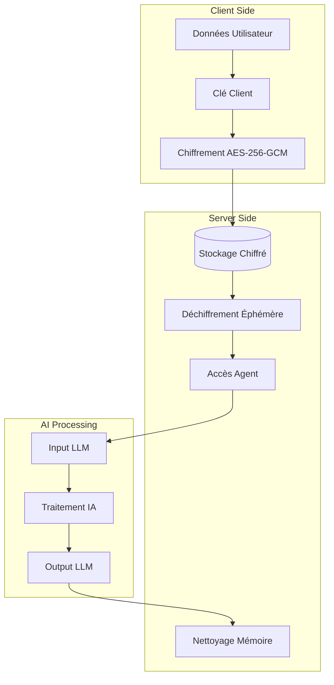

# Spécifications Cryptographiques - Vutler E2E
**Version:** 1.0  
**Date:** 2026-02-23  
**Classification:** Confidentiel Technique  
**Révision:** Audit sécurité requis avant production

## Vue d'Ensemble des Algorithmes

### Algorithmes de Chiffrement Principal

#### AES-256-GCM (Advanced Encryption Standard - Galois/Counter Mode)
**Usage:** Chiffrement symétrique principal pour messages et fichiers

**Spécifications techniques:**
- **Taille de clé:** 256 bits (32 bytes)
- **IV/Nonce:** 96 bits (12 bytes) - unique par opération
- **Tag d'authentification:** 128 bits (16 bytes)
- **Mode d'opération:** GCM (Galois/Counter Mode)

**Avantages:**
- Confidentialité + Intégrité en une seule opération
- Performance élevée (AES-NI sur processeurs modernes)
- Parallélisable pour gros fichiers
- Standard NIST approuvé

**Implémentation WebCrypto:**
```javascript
const algorithm = {
  name: "AES-GCM",
  iv: crypto.getRandomValues(new Uint8Array(12)), // 96-bit IV
  tagLength: 128 // 128-bit authentication tag
};

const encryptedData = await crypto.subtle.encrypt(
  algorithm,
  key,
  plaintext
);
```

#### PBKDF2 (Password-Based Key Derivation Function 2)
**Usage:** Dérivation de clés à partir de mots de passe utilisateur

**Spécifications techniques:**
- **Hash function:** SHA-256
- **Iterations minimum:** 100,000 (ajustable selon performance)
- **Salt:** 128 bits (16 bytes) unique par utilisateur
- **Output key length:** 256 bits (32 bytes)

**Calcul du nombre d'itérations optimal:**
```javascript
// Target: 200ms sur hardware moyen (2024)
function calculateOptimalIterations() {
  const startTime = performance.now();
  let iterations = 10000;
  
  // Test rapide pour calibrer
  while ((performance.now() - startTime) < 50) {
    iterations += 10000;
    // Test PBKDF2 avec iterations
  }
  
  return Math.max(100000, iterations);
}
```

#### RSA-OAEP-256 (RSA Optimal Asymmetric Encryption Padding)
**Usage:** Échange de clés pour partage d'équipe et récupération

**Spécifications techniques:**
- **Taille de clé:** 2048 bits minimum (3072 bits recommandé)
- **Padding:** OAEP avec SHA-256
- **Usage:** Chiffrement de clés AES uniquement (jamais de données directes)

## Stratégie de Génération d'IV (Initialization Vector)

### Génération IV pour AES-GCM
```javascript
class IVGenerator {
  constructor() {
    this.counter = 0n;
    this.randomBase = crypto.getRandomValues(new Uint8Array(8));
  }
  
  generateIV() {
    // IV = random_base(64bits) + counter(32bits)
    const iv = new Uint8Array(12);
    iv.set(this.randomBase, 0);
    
    // Counter en big-endian
    const counterBytes = new Uint8Array(4);
    const counterView = new DataView(counterBytes.buffer);
    counterView.setUint32(0, Number(this.counter++), false);
    
    iv.set(counterBytes, 8);
    
    // Reset counter si overflow (très rare)
    if (this.counter > 0xFFFFFFFFn) {
      this.counter = 0n;
      this.randomBase = crypto.getRandomValues(new Uint8Array(8));
    }
    
    return iv;
  }
}
```

### Unicité et Collision Prevention
- **Probabilité collision:** < 2^-64 pour même utilisateur
- **Storage IV:** Base64 encoded avec chaque message/fichier
- **Validation:** Vérification unicité côté serveur (optionnel)

## Politique de Rotation des Clés

### Rotation Clé Principale Utilisateur
```javascript
const keyRotationPolicy = {
  // Rotation automatique
  maxAge: 365 * 24 * 60 * 60 * 1000, // 1 an
  maxOperations: 1000000, // 1M opérations
  
  // Rotation forcée
  securityIncident: true,
  userRequest: true,
  adminForced: true,
  
  // Méthode de rotation
  rotationMethod: 'gradual', // 'immediate' | 'gradual'
  gracePeriod: 7 * 24 * 60 * 60 * 1000 // 7 jours
};

async function rotateUserMasterKey(userId, reason) {
  // 1. Générer nouvelle clé
  const newMasterKey = await crypto.subtle.generateKey(
    { name: "AES-GCM", length: 256 },
    true,
    ["encrypt", "decrypt"]
  );
  
  // 2. Re-chiffrer toutes les données avec nouvelle clé
  await reEncryptUserData(userId, newMasterKey);
  
  // 3. Invalidation progressive ancienne clé
  await scheduleKeyRevocation(userId, oldKeyId, gracePeriod);
  
  // 4. Notification utilisateur
  await notifyKeyRotation(userId, reason);
}
```

### Rotation Clés de Session
- **Durée de vie:** 24 heures maximum
- **Rotation:** À chaque connexion
- **Révocation:** Logout ou timeout

### Rotation Clés de Fichiers
- **Individual files:** Pas de rotation (performance)
- **Bulk re-encryption:** En cas de compromise utilisateur
- **New uploads:** Toujours nouvelle clé

## Flux de Chiffrement Hybride

### Architecture Hybride pour Accès Agents IA



### Implémentation Déchiffrement Éphémère

```javascript
class EphemeralDecryptor {
  constructor(maxMemoryTime = 30000) { // 30 secondes max
    this.activeDecryptions = new Map();
    this.maxMemoryTime = maxMemoryTime;
  }
  
  async decryptForAgent(encryptedData, keyId, agentId, requestId) {
    try {
      // 1. Vérifier permissions agent
      const hasPermission = await this.checkAgentPermissions(agentId, keyId);
      if (!hasPermission) {
        throw new Error('Agent permission denied');
      }
      
      // 2. Déchiffrer en mémoire sécurisée
      const key = await this.retrieveKey(keyId);
      const plaintext = await crypto.subtle.decrypt(
        { name: "AES-GCM", iv: encryptedData.iv },
        key,
        encryptedData.ciphertext
      );
      
      // 3. Programmer nettoyage automatique
      const cleanupTimer = setTimeout(() => {
        this.cleanupDecryption(requestId);
      }, this.maxMemoryTime);
      
      // 4. Tracker pour audit
      this.activeDecryptions.set(requestId, {
        agentId,
        keyId,
        timestamp: Date.now(),
        cleanupTimer
      });
      
      return new TextDecoder().decode(plaintext);
      
    } catch (error) {
      await this.auditDecryptionFailure(agentId, keyId, error);
      throw error;
    }
  }
  
  cleanupDecryption(requestId) {
    const decryption = this.activeDecryptions.get(requestId);
    if (decryption) {
      clearTimeout(decryption.cleanupTimer);
      this.activeDecryptions.delete(requestId);
      
      // Force garbage collection (Node.js)
      if (global.gc) {
        global.gc();
      }
    }
  }
}
```

## Mécanisme de Récupération de Clés

### Backup Phrase (BIP-39 Compatible)

```javascript
class KeyRecovery {
  // Générer phrase de récupération
  async generateRecoveryPhrase(masterKey) {
    // Export de la clé en format raw
    const rawKey = await crypto.subtle.exportKey("raw", masterKey);
    
    // Génération entropy pour BIP-39
    const entropy = new Uint8Array(32);
    crypto.getRandomValues(entropy);
    
    // Combine clé + entropy
    const combined = new Uint8Array(rawKey.byteLength + entropy.byteLength);
    combined.set(new Uint8Array(rawKey), 0);
    combined.set(entropy, rawKey.byteLength);
    
    // Convertir en mnemonic BIP-39
    const mnemonic = this.entropyToMnemonic(combined);
    
    return {
      phrase: mnemonic,
      checksum: await this.generateChecksum(combined)
    };
  }
  
  // Récupérer clé depuis phrase
  async recoverKeyFromPhrase(phrase, checksum) {
    const entropy = this.mnemonicToEntropy(phrase);
    
    // Vérifier checksum
    const calculatedChecksum = await this.generateChecksum(entropy);
    if (calculatedChecksum !== checksum) {
      throw new Error('Invalid recovery phrase checksum');
    }
    
    // Extraire clé principale
    const keyData = entropy.slice(0, 32);
    
    return await crypto.subtle.importKey(
      "raw",
      keyData,
      { name: "AES-GCM" },
      true,
      ["encrypt", "decrypt"]
    );
  }
}
```

### Emergency Access (Admin Recovery)

```javascript
class EmergencyAccess {
  constructor() {
    // Clé maître administrative (HSM dans le futur)
    this.adminKeyId = process.env.ADMIN_EMERGENCY_KEY_ID;
  }
  
  async createEmergencyBackup(userId, userMasterKey) {
    // Chiffrer clé utilisateur avec clé admin
    const adminKey = await this.getAdminKey();
    
    const encryptedUserKey = await crypto.subtle.encrypt(
      { 
        name: "RSA-OAEP",
        hash: "SHA-256"
      },
      adminKey,
      await crypto.subtle.exportKey("raw", userMasterKey)
    );
    
    // Stocker backup chiffré avec audit trail
    await this.storeEmergencyBackup(userId, {
      encryptedKey: Array.from(new Uint8Array(encryptedUserKey)),
      created: new Date().toISOString(),
      adminKeyVersion: this.adminKeyId
    });
  }
  
  async emergencyRecover(userId, adminAuth) {
    // Vérification admin multi-factor
    await this.verifyAdminAccess(adminAuth);
    
    // Audit log
    await this.auditEmergencyAccess(userId, adminAuth.adminId);
    
    // Récupérer et déchiffrer clé utilisateur
    const backup = await this.getEmergencyBackup(userId);
    const adminKey = await this.getAdminKey();
    
    const userKeyRaw = await crypto.subtle.decrypt(
      { name: "RSA-OAEP", hash: "SHA-256" },
      adminKey,
      new Uint8Array(backup.encryptedKey)
    );
    
    return await crypto.subtle.importKey(
      "raw",
      userKeyRaw,
      { name: "AES-GCM" },
      true,
      ["encrypt", "decrypt"]
    );
  }
}
```

## Approche Synchronisation Multi-Device

### Architecture de Synchronisation

```javascript
class MultiDeviceSync {
  async syncKeyToNewDevice(userId, deviceId, devicePublicKey) {
    // 1. Récupérer clé principale utilisateur chiffrée
    const userEncryptedKey = await this.getUserEncryptedKey(userId);
    
    // 2. Déchiffrer avec mot de passe utilisateur (côté client)
    const userMasterKey = await this.decryptUserKey(userEncryptedKey, userPassword);
    
    // 3. Chiffrer pour nouveau device
    const deviceEncryptedKey = await crypto.subtle.encrypt(
      { name: "RSA-OAEP", hash: "SHA-256" },
      devicePublicKey,
      await crypto.subtle.exportKey("raw", userMasterKey)
    );
    
    // 4. Stocker association device
    await this.storeDeviceKey(userId, deviceId, {
      encryptedKey: Array.from(new Uint8Array(deviceEncryptedKey)),
      syncedAt: new Date().toISOString(),
      deviceFingerprint: await this.getDeviceFingerprint(deviceId)
    });
  }
  
  async revokeDevice(userId, deviceId, reason) {
    // 1. Marquer device comme révoqué
    await this.markDeviceRevoked(userId, deviceId, reason);
    
    // 2. Re-chiffrer toutes les clés actives (excluant ce device)
    const activeDevices = await this.getActiveDevices(userId);
    await this.reEncryptForActiveDevices(userId, activeDevices);
    
    // 3. Notification autres devices
    await this.notifyDeviceRevocation(userId, deviceId, activeDevices);
  }
}
```

## Considérations de Performance

### Benchmarks de Référence
```javascript
// Performance targets sur hardware moyen (2024)
const performanceTargets = {
  keyDerivation: 200, // ms (PBKDF2 100k iterations)
  messageEncryption: 5, // ms (message 1KB)
  fileEncryption: 50, // ms per MB
  keyRotation: 30000, // ms (30s pour 1000 messages)
  agentDecryption: 100 // ms (déchiffrement éphémère)
};

// Métriques à tracker en production
const metrics = {
  encryptionLatency: 'histogram',
  decryptionLatency: 'histogram', 
  keyRotationDuration: 'histogram',
  cryptoErrorRate: 'counter',
  agentAccessCount: 'counter'
};
```

### Optimisations Parallèles
```javascript
class ParallelCrypto {
  async encryptLargeFile(fileBuffer, chunkSize = 1024 * 1024) {
    const chunks = this.splitIntoChunks(fileBuffer, chunkSize);
    
    // Chiffrement parallèle par chunks
    const encryptedChunks = await Promise.all(
      chunks.map(async (chunk, index) => {
        const iv = this.generateSequentialIV(index);
        return await this.encryptChunk(chunk, iv);
      })
    );
    
    return {
      chunks: encryptedChunks,
      metadata: {
        totalSize: fileBuffer.byteLength,
        chunkCount: chunks.length,
        algorithm: 'AES-256-GCM'
      }
    };
  }
}
```

## Standards de Compliance

### FIPS 140-2 Alignment
- **AES implementation:** Utiliser WebCrypto API native (certifiée FIPS)
- **Key generation:** Crypto.getRandomValues() (entropy système)
- **Hash functions:** SHA-256 uniquement
- **Key storage:** Chiffré au repos avec clés hardware

### GDPR/LPD Requirements
- **Right to be forgotten:** Destruction cryptographique des clés
- **Data portability:** Export des clés utilisateur
- **Consent management:** Permissions granulaires par agent
- **Audit trail:** Log complet des accès de déchiffrement

---

**Prochaine révision:** Après audit sécurité externe  
**Responsable crypto:** lopez@starboxgroup.com  
**Validation requise:** Audit ANSSI (si déploiement gouvernemental)