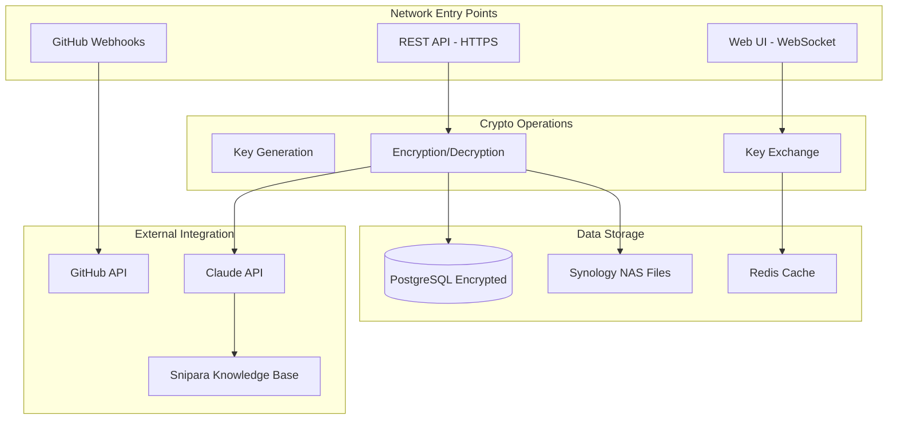

# Plan d'Audit Sécurité - Vutler Phase 2 E2E
**Version:** 1.0  
**Date:** 2026-02-23  
**Classification:** Confidentiel  
**Responsable:** Équipe Sécurité Starbox Group

## Vue d'Ensemble de l'Audit

### Objectifs de l'Audit
1. **Validation cryptographique** des implémentations E2E
2. **Test de pénétration** sur les nouveaux endpoints
3. **Conformité GDPR/LPD** pour les données chiffrées
4. **Audit de performance** impact chiffrement
5. **Validation architecture** sécurité multi-couches

### Méthodologie STRIDE pour E2E

#### Spoofing (Usurpation d'identité)
**Menaces identifiées:**
- Usurpation clés de chiffrement utilisateur
- Replay attacks sur key exchange
- Falsification identité agent IA

**Tests à effectuer:**
```bash
# Test usurpation de clé
curl -X POST /api/v1/chat/messages/encrypted \
  -H "X-Encryption-Key-ID: stolen_key_uuid" \
  -d '{"encryptedContent": "malicious_payload"}'

# Test replay attack
# Capturer request valide et rejouer avec timestamp modifié

# Test agent impersonation
curl -X GET /api/v1/chat/messages/123/decrypt \
  -H "X-Agent-ID: fake-admin-agent"
```

**Contrôles de sécurité:**
- [ ] Validation signature HMAC sur requests critiques
- [ ] Timestamp validation (±5min window)
- [ ] Agent whitelist strict
- [ ] Device fingerprinting

#### Tampering (Altération de données)
**Menaces identifiées:**
- Modification messages chiffrés en transit
- Corruption intentionnelle fichiers VDrive
- Manipulation webhooks GitHub

**Tests à effectuer:**
```python
# Test intégrité message chiffré
def test_message_integrity():
    # Intercepter message chiffré
    encrypted_msg = capture_encrypted_message()
    
    # Modifier 1 bit aléatoire
    corrupted_msg = flip_random_bit(encrypted_msg)
    
    # Tenter déchiffrement - doit échouer
    result = decrypt_message(corrupted_msg)
    assert result.error == "AUTHENTICATION_FAILED"

# Test corruption fichier
def test_file_corruption():
    file_chunks = upload_encrypted_file("test.pdf")
    
    # Corrompre un chunk
    corrupt_chunk(file_chunks[0])
    
    # Download doit détecter la corruption
    download_result = download_file()
    assert download_result.integrity_check == False
```

**Contrôles de sécurité:**
- [ ] Validation tags d'authentification AES-GCM
- [ ] Checksums intégrité fichiers
- [ ] Signature cryptographique webhooks GitHub

#### Repudiation (Répudiation)
**Menaces identifiées:**
- Déni envoi message chiffré
- Contestation accès agent aux données
- Répudiation actions GitHub auto-deploy

**Tests à effectuer:**
- Audit logs exhaustifs toutes opérations crypto
- Signatures non-répudiables pour actions critiques
- Timestamping cryptographique

**Contrôles de sécurité:**
- [ ] Audit trail immutable (PostgreSQL + signatures)
- [ ] Non-repudiation via RSA signatures
- [ ] Logs centralisés avec protection tamper-proof

#### Information Disclosure (Divulgation d'informations)
**Menaces identifiées:**
- Fuite clés de chiffrement en mémoire
- Exposition métadonnées non-chiffrées
- Leak informations via timing attacks

**Tests à effectuer:**
```python
# Test memory leak clés
def test_key_memory_leak():
    # Déclencher déchiffrement éphémère
    decrypt_request = trigger_agent_decryption()
    
    # Forcer garbage collection
    force_gc()
    
    # Scanner mémoire process pour résidus clés
    memory_dump = get_process_memory()
    assert not contains_crypto_keys(memory_dump)

# Test timing attack
def test_timing_attack():
    times_valid = []
    times_invalid = []
    
    # Mesurer temps réponse clés valides vs invalides
    for i in range(1000):
        start = time.time()
        try_decrypt(valid_key if i % 2 else invalid_key)
        end = time.time()
        
        (times_valid if i % 2 else times_invalid).append(end - start)
    
    # Ne doit pas révéler info via timing
    assert abs(mean(times_valid) - mean(times_invalid)) < 0.001
```

**Contrôles de sécurité:**
- [ ] Zero-memory après déchiffrement éphémère
- [ ] Constant-time crypto operations
- [ ] Minimal metadata exposure

#### Denial of Service (Déni de service)
**Menaces identifiées:**
- Épuisement CPU via opérations crypto intensives
- Saturation stockage avec fichiers chiffrés volumineux
- Flooding webhooks GitHub

**Tests à effectuer:**
```bash
# Test DoS crypto operations
for i in {1..1000}; do
  curl -X POST /api/v1/auth/encryption/setup \
    -d '{"iterations": 1000000}' &
done

# Test file upload bombing
dd if=/dev/zero of=huge_file.bin bs=1M count=1000
curl -X POST /api/v1/vdrive/chat/upload \
  -F file=@huge_file.bin

# Test webhook flooding
for i in {1..10000}; do
  curl -X POST /api/v1/github/webhook/test \
    -H "X-GitHub-Event: push" \
    -d '{"commits": [...]}'
done
```

**Contrôles de sécurité:**
- [ ] Rate limiting operations crypto
- [ ] File size limits avec quotas utilisateur
- [ ] Webhook throttling et validation

#### Elevation of Privilege (Élévation de privilèges)
**Menaces identifiées:**
- Agent IA accède à données sans permissions
- Utilisateur accède à clés d'autres utilisateurs
- Admin bypass des contrôles chiffrement

**Tests à effectuer:**
```python
# Test privilege escalation agent
def test_agent_privilege_escalation():
    # Agent avec permissions limitées
    limited_agent = create_agent("file-reader", ["metadata_only"])
    
    # Tenter accès contenu chiffré
    response = limited_agent.request_file_content(sensitive_file_id)
    assert response.status == "ACCESS_DENIED"
    
    # Tenter bypass via manipulation headers
    malicious_request = {
        "headers": {"X-Agent-ID": "admin-agent"},
        "body": {"file_id": sensitive_file_id}
    }
    response = send_request(malicious_request)
    assert response.status != "SUCCESS"

# Test cross-user key access
def test_cross_user_key_access():
    user1_key = get_user_encryption_key(user1_id)
    
    # User2 tente d'utiliser clé de User1
    attempt = user2_session.decrypt_with_key(user1_key, user1_message)
    assert attempt.error == "KEY_ACCESS_DENIED"
```

**Contrôles de sécurité:**
- [ ] Matrice permissions agent stricte
- [ ] Isolation clés par utilisateur/tenant
- [ ] Validation autorization sur chaque requête

## Analyse Surface d'Attaque

### Points d'Entrée Critiques



### Matrice Risque/Impact

| Surface d'attaque | Probabilité | Impact | Risque | Priorité |
|-------------------|-------------|---------|--------|----------|
| WebCrypto API client-side | Moyenne | Élevé | **Élevé** | P1 |
| Agent déchiffrement éphémère | Élevée | Moyen | **Élevé** | P1 |
| Key exchange multi-device | Faible | Élevé | Moyen | P2 |
| GitHub webhook validation | Élevée | Faible | Moyen | P2 |
| VDrive file encryption | Moyenne | Moyen | Moyen | P2 |
| Database encryption at rest | Faible | Moyen | Faible | P3 |

## Scénarios de Test de Pénétration

### Scénario 1: Compromission Clé Utilisateur
**Objectif:** Tester la résistance à la compromission d'une clé utilisateur

**Étapes:**
1. Obtenir accès à la clé maître utilisateur (via malware simulé)
2. Tenter déchiffrement de tous les messages/fichiers
3. Essayer l'accès cross-user avec la clé compromise
4. Tester les mécanismes de révocation de clé

**Critères de succès:**
- Détection compromission dans les 24h
- Révocation automatique clé compromise
- Zero-access aux données autres utilisateurs
- Recovery process fonctionnel

### Scénario 2: Agent IA Malveillant
**Objectif:** Évaluer les contrôles d'accès des agents aux données chiffrées

**Étapes:**
1. Simuler agent IA compromis/malveillant
2. Tenter accès à des données sans permissions appropriées
3. Essayer l'exfiltration de données via API calls
4. Test bypass des limites de déchiffrement éphémère

**Critères de succès:**
- Blocage des accès non-autorisés
- Audit trail complet des tentatives
- Rate limiting effectif
- Alertes temps réel

### Scénario 3: Attaque Man-in-the-Middle
**Objectif:** Tester la protection contre interception des communications

**Étapes:**
1. Intercepter trafic WebSocket messages chiffrés
2. Tenter modification/replay des messages
3. Essayer downgrade attacks sur crypto
4. Test de l'intégrité bout-en-bout

**Critères de succès:**
- Échec modification messages en transit
- Détection replay attacks
- Maintien niveau crypto fort
- Validation intégrité systématique

### Scénario 4: GitHub Integration Attack
**Objectif:** Évaluer sécurité de l'intégration GitHub

**Étapes:**
1. Compromettre compte GitHub connecté
2. Envoyer webhooks malveillants
3. Tenter injection via auto-deploy
4. Test déni de service via webhook flooding

**Critères de succès:**
- Validation signatures webhooks
- Isolation processus auto-deploy
- Rate limiting webhooks efficace
- Détection activité suspecte

## Checklist Revue de Code

### Cryptographie
- [ ] **Algorithmes approuvés**: Seuls AES-256-GCM, PBKDF2, RSA-OAEP utilisés
- [ ] **Génération IV/Nonce**: Unique et aléatoire pour chaque opération
- [ ] **Gestion clés**: Pas de clés hardcodées ou prévisibles
- [ ] **Entropy**: Utilisation sources entropy sécurisées (crypto.getRandomValues)
- [ ] **Key derivation**: PBKDF2 avec iterations >= 100,000
- [ ] **Memory management**: Clés effacées après usage

### Authentification
- [ ] **JWT validation**: Signature, expiration, audience vérifiées
- [ ] **Session management**: Timeout, révocation, multi-device
- [ ] **Rate limiting**: Sur endpoints sensibles (auth, crypto)
- [ ] **CSRF protection**: Tokens CSRF sur actions modifiant l'état
- [ ] **Device fingerprinting**: Binding sessions aux devices

### API Security
- [ ] **Input validation**: Sanitization tous inputs utilisateur
- [ ] **Output encoding**: Pas de leak d'informations sensibles
- [ ] **Error handling**: Messages d'erreur génériques en production
- [ ] **HTTPS enforcement**: TLS 1.3 minimum, HSTS headers
- [ ] **Content Security Policy**: Restrictive CSP headers

### Agent Access Control
- [ ] **Permissions matrix**: Validation granulaire par agent/resource
- [ ] **Audit logging**: Tous accès agents aux données chiffrées
- [ ] **Timeout enforcement**: Déchiffrement éphémère respecté
- [ ] **Memory isolation**: Pas de leak entre contexts agents
- [ ] **Privilege validation**: Verification permissions à chaque request

### Data Protection
- [ ] **Encryption at rest**: Base données et fichiers chiffrés
- [ ] **Encryption in transit**: TLS pour toutes communications
- [ ] **Data classification**: Marquage niveau sensibilité
- [ ] **Retention policies**: Purge données selon politique
- [ ] **Backup security**: Backups chiffrés avec clés séparées

## Audit Dépendances

### Scan Vulnérabilités Dependencies
```bash
# Node.js dependencies
npm audit --audit-level high
snyk test --severity-threshold=medium

# Specific crypto libraries check
npm ls crypto-js
npm ls node-forge
npm ls bcryptjs

# Check for deprecated crypto modules
grep -r "crypto-js" node_modules/ | grep "deprecated"
```

### Dependencies Critiques à Auditer
```json
{
  "high_priority": [
    "@noble/secp256k1",
    "crypto-js", 
    "bcryptjs",
    "jsonwebtoken",
    "express-rate-limit"
  ],
  "monitoring": [
    "ws", // WebSocket library
    "multer", // File upload
    "axios", // HTTP client pour APIs externes
    "pg", // PostgreSQL driver
    "redis" // Redis client
  ]
}
```

### Criteria de Validation Dependencies
- [ ] **No known vulnerabilities** (CVE score < 4.0)
- [ ] **Active maintenance** (dernière release < 6 mois)
- [ ] **Security contact** disponible
- [ ] **License compliance** (pas de licenses incompatibles)
- [ ] **Supply chain verification** (signatures packages)

## Conformité GDPR/LPD

### Audit Conformité Data Protection

#### Article 32 - Sécurité du traitement
- [ ] **Pseudonymisation** des données personnelles chiffrées
- [ ] **Chiffrement** des données personnelles en transit et au repos
- [ ] **Intégrité** et confidentialité assurées
- [ ] **Résilience** systèmes face aux incidents

#### Article 33 - Notification violations
- [ ] **Détection** violations dans les 72h
- [ ] **Documentation** incidents sécurité
- [ ] **Notification** autorités compétentes
- [ ] **Communication** individus concernés si risque élevé

#### Article 20 - Portabilité des données
- [ ] **Export** clés utilisateur en format standard
- [ ] **Import** données depuis autres systèmes
- [ ] **Migration** transparente entre providers
- [ ] **APIs** pour accès programmatique

#### Article 17 - Droit à l'effacement
```python
def test_right_to_erasure():
    """Test suppression cryptographique des données"""
    user_id = create_test_user()
    
    # User crée du contenu chiffré
    messages = create_encrypted_messages(user_id, count=100)
    files = upload_encrypted_files(user_id, count=50)
    
    # Demande suppression
    deletion_request = submit_deletion_request(user_id)
    
    # Vérifier suppression effective
    assert deletion_request.status == "COMPLETED"
    
    # Clés utilisateur détruites
    assert get_user_keys(user_id) == None
    
    # Données impossibles à déchiffrer
    for msg in messages:
        assert decrypt_message(msg.encrypted_content) == "KEY_NOT_FOUND"
    
    # Métadonnées anonymisées
    assert get_user_profile(user_id).email == "deleted_user_xxx"
```

### Registre des Traitements
```json
{
  "traitement_chiffrement_e2e": {
    "finalite": "Protection données utilisateurs par chiffrement bout-en-bout",
    "base_legale": "Consentement utilisateur (Art. 6.1.a GDPR)",
    "categories_donnees": [
      "Messages chat chiffrés",
      "Fichiers VDrive chiffrés", 
      "Clés de chiffrement utilisateur",
      "Métadonnées chiffrement"
    ],
    "destinataires": [
      "Agents IA (déchiffrement éphémère sous conditions)",
      "Administrateurs système (clés de récupération uniquement)"
    ],
    "duree_conservation": "Tant que compte utilisateur actif + 30 jours",
    "mesures_securite": [
      "Chiffrement AES-256-GCM",
      "Clés stockées chiffrées avec mot de passe utilisateur",
      "Audit trail complet accès",
      "Déchiffrement éphémère avec TTL 30s"
    ],
    "droits_personnes": {
      "acces": "Via interface utilisateur après authentification",
      "rectification": "Re-chiffrement avec nouvelles données",
      "effacement": "Destruction cryptographique des clés",
      "portabilite": "Export clés + données déchiffrées"
    }
  }
}
```

## Planning d'Exécution Audit

### Phase 1: Audit Statique (Semaine 1-2)
- [ ] **J1-3**: Revue code cryptographique
- [ ] **J4-5**: Scan vulnérabilités dependencies
- [ ] **J6-7**: Analyse conformité GDPR/LPD
- [ ] **J8-10**: Documentation threats model STRIDE

### Phase 2: Tests Dynamiques (Semaine 3-4)  
- [ ] **J11-13**: Tests pénétration API endpoints
- [ ] **J14-15**: Simulation compromission clés
- [ ] **J16-17**: Tests performance impact chiffrement
- [ ] **J18-20**: Validation scénarios d'usage

### Phase 3: Rapport et Remédiation (Semaine 5-6)
- [ ] **J21-22**: Consolidation findings
- [ ] **J23-25**: Rédaction rapport audit complet
- [ ] **J26-28**: Plan remédiation avec priorités
- [ ] **J29-30**: Présentation résultats équipe

### Livrables Attendus
1. **Rapport d'audit complet** (50+ pages)
2. **Matrice risques détaillée** avec scoring CVSS
3. **Plan de remédiation priorisé** avec timeline
4. **Checklist validation sécurité** pour production
5. **Procédures incident response** spécifiques crypto
6. **Certification conformité GDPR/LPD**

### Budget et Ressources
- **Audit interne**: 2 semaines × 2 ingénieurs sécurité
- **Audit externe**: 1 semaine pentester certifié + audit crypto
- **Outils**: Burp Suite Pro, OWASP ZAP, Snyk, SonarQube
- **Budget total estimé**: 15,000€ (interne + externe + outils)

---

**Responsable audit**: lopez@starboxgroup.com  
**Validation finale**: Alex Starbox (CEO)  
**Date limite remise**: 2026-03-15  
**Classification**: Confidentiel - Distribution restreinte équipe