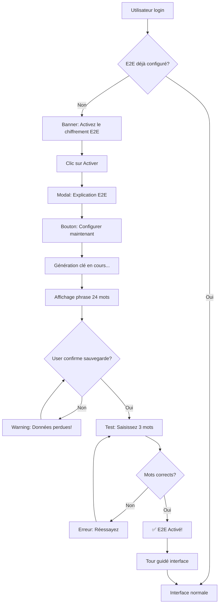
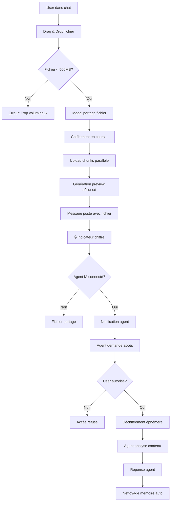
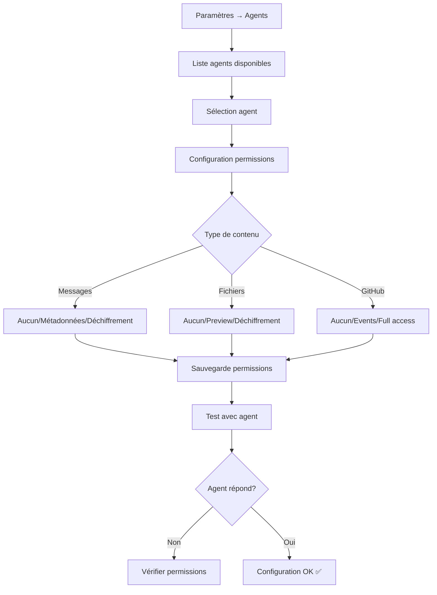
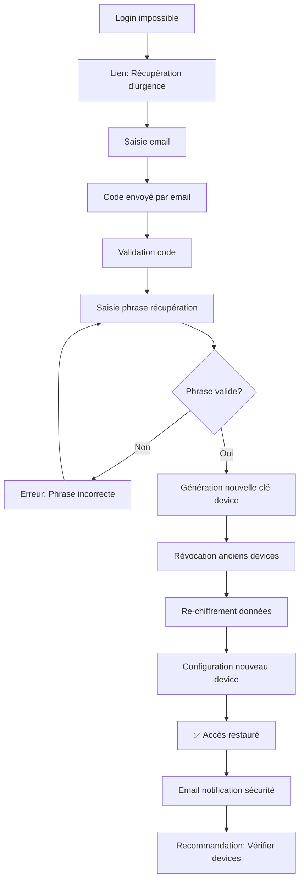

# Plans UI/UX - Vutler Phase 2 E2E & VDrive
**Version:** 1.0  
**Date:** 2026-02-23  
**Design System:** Vutler DS v2.0  
**Responsable UX:** Équipe Design Starbox Group

## Design System Existant - Extensions

### Palette Couleurs Vutler
```scss
// Couleurs principales (existantes)
$navy-primary: #1a1a2e;        // Fond principal
$electric-blue: #0066ff;        // CTA et éléments interactifs
$light-gray: #f4f6f8;          // Fond secondaire
$medium-gray: #8b9da9;         // Texte secondaire
$dark-gray: #2d3748;           // Texte principal

// Nouvelles couleurs sécurité
$security-green: #10b981;       // ✅ Chiffré/Sécurisé
$security-orange: #f59e0b;      // ⚠️ Attention/Partiel
$security-red: #ef4444;         // ❌ Erreur/Non sécurisé
$security-blue: #3b82f6;        // 🔒 Indicateurs chiffrement
$agent-purple: #8b5cf6;         // 🤖 Actions agents IA
```

### Typographie
```scss
// Font existante (maintenue)
$font-family: 'Inter', -apple-system, sans-serif;

// Poids et tailles étendus
$font-weight-bold: 700;         // Headings (existant)
$font-weight-semibold: 600;     // Nouveau - Labels sécurité
$font-weight-medium: 500;       // Nouveau - États système
$font-weight-regular: 400;      // Corps de texte (existant)

$text-security: 14px;          // Nouveau - Indicateurs sécurité
$text-meta: 12px;              // Nouveau - Métadonnées fichiers
$text-code: 13px;              // Nouveau - IDs techniques
```

### Iconographie Sécurité
```scss
// Nouveaux icônes système
.icon-lock-closed { color: $security-green; }    // 🔒 Chiffré
.icon-lock-open { color: $security-orange; }     // 🔓 Partiel
.icon-shield-check { color: $security-green; }   // ✅ Validé
.icon-exclamation { color: $security-orange; }   // ⚠️ Attention
.icon-x-circle { color: $security-red; }         // ❌ Erreur
.icon-robot { color: $agent-purple; }            // 🤖 Agent IA
.icon-cloud-upload { color: $electric-blue; }    // ☁️ Upload VDrive
```

## Wireframes Vchat avec Panel VDrive

### Layout Principal - Vue Desktop

```
┌─────────────────────────────────────────────────────────────────┐
│ Vutler Header                                          [🔒E2E]   │
├─────────────────┬───────────────────────────┬─────────────────────┤
│ Sidebar         │ Chat Principal            │ VDrive Panel        │
│                 │                           │                     │
│ 💬 Conversations│ ┌─────────────────────┐   │ 📁 Mes Fichiers     │
│ ├─ General      │ │ 👤 User: Message    │   │ ├─ 📂 Projets       │
│ ├─ 🔒 Confidentiel│ │      chiffré...   │   │ │  ├─ rapport.pdf   │
│ └─ Marketing    │ │ [🔒 Chiffré ✅]     │   │ │  └─ budget.xlsx   │
│                 │ └─────────────────────┘   │ ├─ 📂 Images        │
│ 🤖 Agents IA    │                           │ │  └─ logo.png      │
│ ├─ Claude       │ ┌─────────────────────┐   │ └─ 📂 Temporaire    │
│ ├─ Code Assistant│ │ 🤖 Claude: Analyse │   │                     │
│ └─ Analytics    │ │     rapport...      │   │ [🔍 Rechercher...] │
│                 │ │ [⚡ Ephémère 15s]   │   │                     │
│ 📊 Dashboard    │ └─────────────────────┘   │ ┌─────────────────┐ │
│                 │                           │ │ 📎 Drop files   │ │
│                 │ ┌─────────────────────┐   │ │    here or      │ │
│                 │ │ [📎] [🎤] [🔗]     │   │ │   📁 Browse     │ │
│                 │ │ Tapez message...    │   │ └─────────────────┘ │
│                 │ └─────────────────────┘   │                     │
└─────────────────┴───────────────────────────┴─────────────────────┘
```

### Layout Mobile - Vue Chat avec VDrive

```
┌─────────────────────────┐
│ 🔒 Confidentiel    [⚙️] │ ← Header avec statut E2E
├─────────────────────────┤
│ 👤 User: Voici le      │
│     rapport Q4...       │
│ [🔒 Chiffré ✅]        │
│                         │
│ 🤖 Claude: Je vois     │ 
│     votre rapport...    │
│ [⚡ Éphémère 12s]      │
│                         │
│ 📎 rapport-q4.pdf      │ ← Fichier partagé inline
│ [👁️ Preview] [⬇️ DL]   │
│                         │
├─────────────────────────┤
│ [📁] [📎] [🎤] [🔗]   │ ← Barre actions
│ Tapez message...        │
└─────────────────────────┘

// Swipe right = Panel VDrive
┌─────────────────────────┐
│ 📁 VDrive         [✕]  │
├─────────────────────────┤
│ 🔍 Rechercher...       │ 
├─────────────────────────┤
│ 📂 Récents             │
│ ├─ 📄 rapport.pdf 🔒   │
│ ├─ 📊 budget.xlsx 🔒   │
│ └─ 🎨 logo.png 🌍      │
│                         │
│ 📂 Projets             │
│ 📂 Équipe              │
│ 📂 Archives            │
│                         │
├─────────────────────────┤
│ [📤 Upload] [📱 Camera]│
└─────────────────────────┘
```

## User Flows Détaillés

### Flow 1: Première Configuration E2E



### Flow 2: Envoi Message avec Fichier Chiffré



### Flow 3: Configuration Permissions Agent



### Flow 4: Récupération d'Urgence



## Wireframes Spécifiques par Composant

### Composant: Message Chiffré

```
┌─────────────────────────────────────────┐
│ 👤 John Doe                    14:32     │
├─────────────────────────────────────────┤
│ Voici le rapport confidentiel Q4        │
│ avec les chiffres sensibles...          │
│                                         │
│ ┌─────────────────────────────────────┐ │
│ │ 📎 rapport-financier-q4.pdf       │ │
│ │ 2.4 MB • Chiffré                   │ │
│ │ [👁️ Preview] [⬇️ Download]        │ │
│ └─────────────────────────────────────┘ │
│                                         │
│ [🔒 Chiffré bout en bout] [⚡ Claude]  │ ← Statuts
└─────────────────────────────────────────┘
```

### Composant: Réponse Agent avec Statut Éphémère

```
┌─────────────────────────────────────────┐
│ 🤖 Claude Assistant           14:35     │
├─────────────────────────────────────────┤
│ J'ai analysé votre rapport Q4:          │
│                                         │
│ 📊 Points positifs:                    │
│ • Croissance CA: +15%                  │
│ • Marge améliorée: 68%                 │
│                                         │
│ ⚠️ Points d'attention:                  │
│ • Coûts marketing élevés               │
│                                         │
│ ┌─────────────────────────────────────┐ │
│ │ ⚡ Déchiffrement éphémère actif    │ │
│ │ 🕐 Expire dans 23 secondes          │ │
│ │ 🧹 Données effacées après traitement│ │
│ └─────────────────────────────────────┘ │
└─────────────────────────────────────────┘
```

### Composant: Panel VDrive Intégré

```
┌─────────────────────────────────────────┐
│ 📁 VDrive                    [−] [×]    │
├─────────────────────────────────────────┤
│ 🔍 [Rechercher fichiers...]           │
├─────────────────────────────────────────┤
│ 📂 Dossiers                            │
│ ├─ 📁 Projets (12) ▼                   │
│ │  ├─ 📄 contrat_acme.pdf 🔒           │
│ │  ├─ 📊 budget_2026.xlsx 🔒           │
│ │  └─ 📋 notes_reunion.md 🌍           │
│ ├─ 📁 Marketing (8) ▶                  │
│ └─ 📁 Archives (45) ▶                  │
│                                         │
│ 📎 Récents                             │
│ ├─ logo_v2.png 🌍       [Share]       │
│ ├─ rapport_q4.pdf 🔒     [Share]       │
│ └─ demo_video.mp4 ⏰     [Share]       │
│                                         │
├─────────────────────────────────────────┤
│ ┌─────────┐ ┌─────────┐ ┌──────────┐   │
│ │📤Upload │ │📱Camera │ │🔗Link    │   │
│ └─────────┘ └─────────┘ └──────────┘   │
└─────────────────────────────────────────┘
```

### Composant: Configuration E2E - Phrase de Récupération

```
┌─────────────────────────────────────────┐
│ 🔐 Configuration Chiffrement E2E        │
├─────────────────────────────────────────┤
│ ⚠️ IMPORTANT: Sauvegardez cette phrase  │
│                                         │
│ Votre phrase de récupération (24 mots): │
│                                         │
│ ┌─────────────────────────────────────┐ │
│ │ abandon ability able about above    │ │
│ │ absent absorb abstract absurd abuse │ │
│ │ access accident account accurate    │ │
│ │ achieve acid acoustic acquire      │ │
│ │ across act action actor actress     │ │
│ │ actual adapt add address adjust     │ │
│ └─────────────────────────────────────┘ │
│                                         │
│ 📝 Notez cette phrase en sécurité      │
│ 🚫 Ne la partagez jamais               │
│ ⚠️ Sans elle, vos données sont perdues │
│                                         │
│ ☑️ J'ai sauvegardé ma phrase           │
│                                         │
│ [Annuler]              [Continuer →]   │
└─────────────────────────────────────────┘
```

## Indicateurs et Feedback Visuels

### États de Chiffrement

```scss
// Styles pour indicateurs de chiffrement
.encryption-status {
  &.encrypted {
    background: rgba($security-green, 0.1);
    border-left: 3px solid $security-green;
    
    .status-icon {
      color: $security-green;
      &::before { content: "🔒"; }
    }
  }
  
  &.partial {
    background: rgba($security-orange, 0.1);
    border-left: 3px solid $security-orange;
    
    .status-icon {
      color: $security-orange;
      &::before { content: "⚠️"; }
    }
  }
  
  &.error {
    background: rgba($security-red, 0.1);
    border-left: 3px solid $security-red;
    
    .status-icon {
      color: $security-red;
      &::before { content: "❌"; }
    }
  }
}
```

### États Agent IA

```scss
// Styles pour activité agents
.agent-activity {
  &.ephemeral-active {
    background: linear-gradient(45deg, rgba($agent-purple, 0.1), transparent);
    border: 1px solid $agent-purple;
    animation: pulse-ephemeral 2s infinite;
    
    .timer {
      color: $agent-purple;
      font-weight: $font-weight-semibold;
      font-size: $text-security;
    }
  }
}

@keyframes pulse-ephemeral {
  0%, 100% { opacity: 0.6; }
  50% { opacity: 1; }
}
```

### Micro-interactions

```scss
// Animations de feedback
.upload-progress {
  .chunk-progress {
    width: 100%;
    height: 4px;
    background: $light-gray;
    border-radius: 2px;
    overflow: hidden;
    
    &::after {
      content: '';
      display: block;
      height: 100%;
      background: linear-gradient(90deg, 
        $electric-blue 0%, 
        $security-blue 50%, 
        $electric-blue 100%);
      animation: upload-shine 1.5s infinite;
    }
  }
}

@keyframes upload-shine {
  0% { transform: translateX(-100%); }
  100% { transform: translateX(100%); }
}

// Feedback déchiffrement
.decrypt-feedback {
  &.success {
    background: $security-green;
    color: white;
    padding: 4px 8px;
    border-radius: 4px;
    font-size: $text-meta;
    animation: fade-in-out 3s ease;
  }
}

@keyframes fade-in-out {
  0%, 100% { opacity: 0; }
  10%, 90% { opacity: 1; }
}
```

## Responsive Design - Adaptations Mobile

### Breakpoints
```scss
$mobile: 480px;
$tablet: 768px;
$desktop: 1024px;
$desktop-large: 1440px;
```

### Layout Mobile - Chat + VDrive

```
Mobile Portrait (320-480px)
┌─────────────────┐
│ Header + E2E    │ 48px
├─────────────────┤
│                 │
│    Chat Area    │ Flexible
│                 │
├─────────────────┤
│ VDrive Toggle   │ 40px - Swipe up pour panel
├─────────────────┤
│ Message Input   │ 60px
└─────────────────┘

Mobile Landscape (480px+)
┌─────────────────────────────┐
│ Header    │ VDrive Mini     │ 48px
├───────────┼─────────────────┤
│           │ Recent Files    │
│ Chat Area │ - doc.pdf       │ Flexible
│           │ - img.png       │
├───────────┼─────────────────┤
│ Input     │ Upload Button   │ 60px
└───────────┴─────────────────┘
```

### Adaptations Tactiles

```scss
// Zones de touch optimisées
.touch-target {
  min-height: 44px;  // iOS guidelines
  min-width: 44px;
  padding: 12px;
}

// Gestures
.vdrive-panel {
  &.mobile {
    // Swipe up pour ouvrir
    touch-action: pan-y;
    transform: translateY(80%);
    transition: transform 0.3s ease;
    
    &.expanded {
      transform: translateY(0);
    }
  }
}

// Upload par drag mobile
.mobile-upload-zone {
  border: 2px dashed $electric-blue;
  border-radius: 8px;
  padding: 20px;
  text-align: center;
  
  &.drag-over {
    background: rgba($electric-blue, 0.1);
    border-color: $security-green;
  }
}
```

## Accessibilité et Inclusivité

### Support Lecteurs d'Écran

```html
<!-- Message chiffré -->
<div class="message encrypted" 
     role="article" 
     aria-label="Message chiffré de John Doe">
  
  <div class="message-content">
    <span aria-hidden="true">🔒</span>
    <span class="sr-only">Message chiffré de bout en bout</span>
    Contenu du message...
  </div>
  
  <div class="encryption-status" 
       aria-live="polite"
       aria-label="Statut de chiffrement: Sécurisé">
    Chiffré bout en bout
  </div>
</div>

<!-- Agent éphémère -->
<div class="agent-response ephemeral"
     role="article"
     aria-live="assertive"
     aria-label="Réponse agent Claude, déchiffrement temporaire actif">
     
  <div class="ephemeral-timer" 
       aria-live="polite"
       aria-label="Expire dans 15 secondes">
    ⚡ 15s
  </div>
</div>
```

### Contraste et Lisibilité

```scss
// Ratios de contraste WCAG 2.1 AA
$contrast-ratios: (
  'text-primary': 4.5,    // Texte principal
  'text-security': 7.0,   // Indicateurs sécurité
  'interactive': 3.0,     // Éléments interactifs
  'focus': 4.5           // États de focus
);

// Mode haute visibilité
@media (prefers-contrast: high) {
  .encryption-status {
    &.encrypted {
      background: $security-green;
      color: white;
      font-weight: $font-weight-bold;
    }
  }
  
  .agent-activity {
    border-width: 2px;
    font-weight: $font-weight-semibold;
  }
}

// Support reduced motion
@media (prefers-reduced-motion: reduce) {
  .upload-progress::after,
  .agent-activity {
    animation: none;
  }
  
  .vdrive-panel {
    transition: none;
  }
}
```

### Navigation Clavier

```scss
// Focus management
.focus-trap {
  &:focus-within {
    .modal-overlay {
      background: rgba(0,0,0,0.7);
    }
  }
}

// Skip links
.skip-to-content {
  position: absolute;
  top: -40px;
  left: 6px;
  background: $navy-primary;
  color: white;
  padding: 8px;
  text-decoration: none;
  z-index: 1000;
  
  &:focus {
    top: 6px;
  }
}

// Keyboard shortcuts
.keyboard-hint {
  font-size: $text-meta;
  color: $medium-gray;
  
  kbd {
    background: $light-gray;
    border: 1px solid $medium-gray;
    border-radius: 3px;
    padding: 2px 4px;
    font-family: monospace;
    font-size: 11px;
  }
}
```

---

**Designer responsable:** design@starboxgroup.com  
**Review UX:** 2026-03-01  
**Tests utilisateurs:** 2026-03-05  
**Validation finale:** Alex Starbox (CEO)